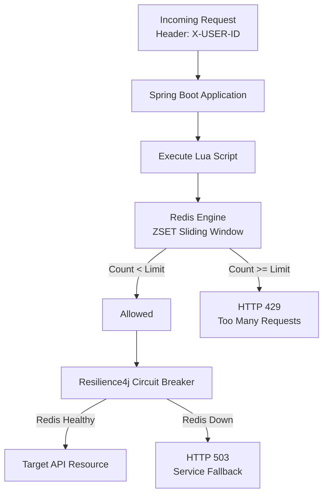

# Distributed API Rate Limiter & Resilience System

[](https://www.oracle.com/java/)
[](https://spring.io/projects/spring-boot)
[](https://redis.io/)
[](https://resilience4j.readme.io/)
[](https://www.docker.com/)
[](LICENSE)

A high-throughput, distributed API rate limiter built with **Spring Boot**, **Redis**, and custom **Lua scripts** using the **Sliding Window Log algorithm**. It protects backend microservices against traffic spikes and abuse while staying available during failures through **Resilience4j circuit breakers**.

---

## Key Features

- **Distributed Rate Limiting** — Global request tracking across multi-instance deployments via centralized Redis storage.
- **Sliding Window Log Algorithm** — Millisecond-precise timestamp tracking with Redis Sorted Sets (`ZSET`), avoiding the boundary-burst problem of fixed-window algorithms.
- **Thread-Safe & Race-Condition Free** — Atomic operations run inside Redis via native Lua scripts, with no application-level locking.
- **Fault Tolerance & Graceful Degradation** — Resilience4j circuit breakers provide a safe fallback during Redis outages or network failures.
- **Multi-Tenant Key Isolation** — Independent limits per user or API key, routed by the `X-USER-ID` header.
- **Container Ready** — Ships with `docker-compose.yml` for quick local and production setup.

---

## Architecture Overview

### System Workflow



### Sliding Window Execution Mechanics

When a request is evaluated:

1. **Prune** — Remove timestamp entries older than `currentTime - windowSize` (`ZREMRANGEBYSCORE`).
2. **Count** — Evaluate the active request volume within the sliding frame (`ZCARD`).
3. **Decide**
   - If `count < max_limit`: register the request timestamp (`ZADD`), reset the TTL (`EXPIRE`), and return `HTTP 200 OK`.
   - If `count >= max_limit`: deny the request and return `HTTP 429 Too Many Requests`.

---

## Tech Stack

| Layer | Technology |
| --- | --- |
| Language & Framework | Java 17, Spring Boot 3.2.3 (Spring Web, Spring Data Redis, Spring AOP) |
| Data Store | Redis 7 (in-memory data structure store) |
| Scripting | Lua (atomic execution inside Redis) |
| Resilience | Resilience4j (circuit breaker & fallback handler) |
| Containerization | Docker & Docker Compose |
| Build Tool | Apache Maven |

---

## Directory Structure

```text
rate-limiter/
├── src/
│   ├── main/
│   │   ├── java/com/example/rate_limiter/
│   │   │   ├── config/
│   │   │   │   └── RedisConfig.java          # Redis script loader beans
│   │   │   ├── controller/
│   │   │   │   └── ApiController.java        # REST controller & circuit breaker
│   │   │   ├── service/
│   │   │   │   └── RateLimiterService.java   # Core rate-limiting logic
│   │   │   └── RateLimiterApplication.java   # Spring Boot entry point
│   │   └── resources/
│   │       ├── application.properties        # Application configuration
│   │       └── scripts/
│   │           └── sliding_window.lua        # Atomic sliding window script
│   └── test/                                 # Unit & integration tests
├── docker-compose.yml                        # Redis container configuration
├── mvnw                                      # Maven wrapper
└── pom.xml                                   # Dependency management
```

---

## Getting Started

### Prerequisites

- Java Development Kit (JDK 17+)
- Git
- Docker Desktop, or Homebrew (for running Redis locally)

### Local Setup & Installation

1. **Clone the repository:**

   ```bash
   git clone https://github.com/<your-username>/rate-limiter.git
   cd rate-limiter
   ```

2. **Start Redis.**

   Via Docker Compose:

   ```bash
   docker compose up -d
   ```

   Or via Homebrew (macOS):

   ```bash
   brew install redis
   brew services start redis
   ```

3. **Build and launch the Spring Boot server:**

   ```bash
   ./mvnw clean spring-boot:run
   ```

   The server starts at `http://localhost:8080`.

---

## Verification & API Usage

> **Default rule:** maximum **3 requests per 10-second window** per user ID.

### 1. Requests within the limit

Fire up to 3 rapid requests:

```bash
curl -i -H "X-USER-ID: testuser" http://localhost:8080/api/test
```

Response:

```http
HTTP/1.1 200 OK
Content-Type: text/plain;charset=UTF-8

Request successful for user: testuser
```

### 2. Rate limit rejection

Fire a 4th request within the same 10-second window:

```bash
curl -i -H "X-USER-ID: testuser" http://localhost:8080/api/test
```

Response:

```http
HTTP/1.1 429 Too Many Requests
Content-Type: text/plain;charset=UTF-8

Rate limit exceeded! Maximum 3 requests per 10 seconds allowed.
```

### 3. Circuit breaker fallback

Stop Redis to trigger resilience handling:

```bash
brew services stop redis   # or: docker stop redis_ratelimiter
```

Send a request:

```bash
curl -i -H "X-USER-ID: testuser" http://localhost:8080/api/test
```

Response:

```http
HTTP/1.1 503 Service Unavailable
Content-Type: text/plain;charset=UTF-8

Redis or downstream issue detected. Request handled by Resilience4j fallback.
```

---

## License

Distributed under the MIT License. See [LICENSE](LICENSE) for details.
